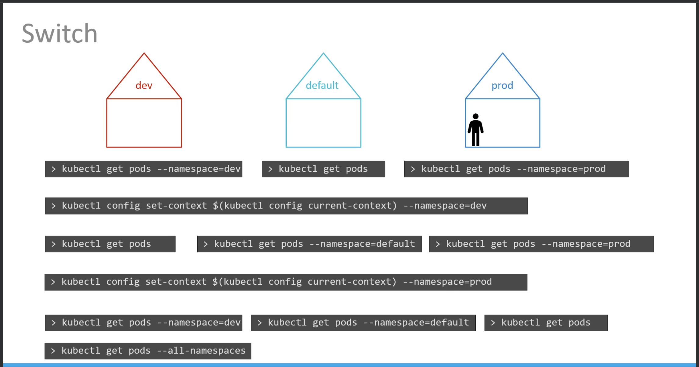
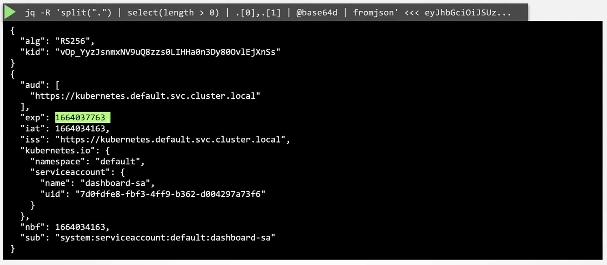

## CNCF Certification
- **Certified Kubernetes Application Developer:** https://www.cncf.io/certification/ckad/
- **Candidate Handbook:** https://www.cncf.io/certification/candidate-handbook
- **Exam Tips:** https://docs.linuxfoundation.org/tc-docs/certification/tips-cka-and-ckad


Keep the code - 20KLOUD handy while registering for the CKA or CKAD exams at Linux Foundation to get a 20% discount.

https://github.com/mmumshad/kubernetes-the-hard-way

https://kodekloud.com/pages/community

---
### Accessing Labs

**Link:** https://uklabs.kodekloud.com/courses/labs-certified-kubernetes-application-developer
Apply the coupon code **udemystudent030485**

---

### Pods
https://uklabs.kodekloud.com/topic/pods-4/
```bash
kubectl get pods
kubectl run nginx --image nginx
kubectl descibe pod my-pod
kubectl delete pod my-pod

kubectl get pods -o wide
kubectl run redis --image redis123 --dry-run -o yaml #deprecated
kubectl run redis --image redis123 --dry-run=client -o yaml

```
#### Edit Pods
A Note on Editing Existing Pods
In any of the practical quizzes, if you are asked to **edit an existing POD**, please note the following:

If you are given a pod definition file, edit that file and use it to create a new pod.

**If you are not given a pod definition file**, you may extract the definition to a file using the below command:
```sh
kubectl get pod <pod-name> -o yaml > pod-definition.yaml
```
Then edit the file to make the necessary changes, delete, and re-create the pod.

To modify the properties of the pod, you can utilize the `kubectl edit pod <pod-name>` **command**. Please note that only the properties listed below are editable.

- spec.containers[*].image
- spec.initContainers[*].image
- spec.activeDeadlineSeconds
- spec.tolerations
- spec.terminationGracePeriodSeconds

---

### ReplicaSets
- ReplicationController **(Old)**
  
- ReplicaSet **(New)**
  

#### Scaling Replicaset


#### Commands
```bash
kubectl create -f rs-definition.yml
kubectl get replicaset
kubectl get rs
kubectl delete replicaset myapp-replicaset
kubectl replace replicaset rs-definition.yml
kubectl scale -replicas=6 -f rs-definition.yml
```
#### Practice Test - ReplicaSets
https://uklabs.kodekloud.com/topic/replicasets-2/

```bash
kubectl explain rs

# modifying image of a replicaset
kubectl edit rs new-replica-set

# Image is updated but pods are still down
kubectl describe rs new-replica-set

# delete all pods. ReplicaSet will create new pods with the updated image
kubectl delete pod new-replica-set-62tmv  new-replica-set-6g6jf  new-replica-set-jw7cd  new-replica-set-pv442

kubectl get rs
NAME              DESIRED   CURRENT   READY   AGE
new-replica-set   4         4         4       27m

#Scale
kubectl scale --replicas=5 rs new-replica-set
#OR
kubectl scale rs new-replica-set --replicas=2

```

### Deployments


```bash
kubectl get all
```

#### Practice Test - Deployments
https://uklabs.kodekloud.com/topic/deployments-5/

```bash

controlplane ~ ➜  kubectl get pods
No resources found in default namespace.

controlplane ~ ➜  kubectl get rs
No resources found in default namespace.

controlplane ~ ➜  kubectl get deployments
No resources found in default namespace.

controlplane ~ ➜  kubectl get deployment
No resources found in default namespace.

```
**Create a deployment with yaml**

```bash
kubectl create deployment --help

arvins-mac @ ~/1-gitspace/kubernetes  (main)
 [28] → kubectl create deployment --help
Create a deployment with the specified name.

Aliases:
deployment, deploy

Examples:
  # Create a deployment named my-dep that runs the busybox image
  kubectl create deployment my-dep --image=busybox

  # Create a deployment with a command
  kubectl create deployment my-dep --image=busybox -- date

  # Create a deployment named my-dep that runs the nginx image with 3 replicas
  kubectl create deployment my-dep --image=nginx --replicas=3

  # Create a deployment named my-dep that runs the busybox image and expose port 5701
  kubectl create deployment my-dep --image=busybox --port=5701

```


```yml
controlplane ~ ➜  cat dep-httpd.yaml 
---
apiVersion: apps/v1
kind: Deployment
metadata:
  name: httpd-frontend
spec:
  replicas: 3
  selector:
    matchLabels:
      name: httpd-pod
  template:
    metadata:
      labels:
        name: httpd-pod
    spec:
      containers:
      - name: httpd-container
        image: httpd:2.4-alpines
```

#### Certification Tip: Formatting Output with kubectl
The default output format for all `kubectl` commands is the human-readable plain-text format.

The `-o` flag allows us to output the details in several different formats.

**kubectl [command] [TYPE] [NAME] -o <output_format>**
Here are some of the commonly used formats:
1. `-o jsonOutput` a JSON formatted API object.
2. `-o namePrint` only the resource name and nothing else.
3. `-o wideOutput` in the plain-text format with any additional information.
4. `-o yamlOutput` a YAML formatted API object.

Here are some useful examples:

**Output with JSON format:**
```sh
kubectl create namespace test-123 --dry-run -o json
```
```json
{
    "kind": "Namespace",
    "apiVersion": "v1",
    "metadata": {
        "name": "test-123",
        "creationTimestamp": null
    },
    "spec": {},
    "status": {}
}
```
**Output with YAML format:**
```sh
kubectl create namespace test-123 --dry-run -o yaml
```
```yml
apiVersion: v1
kind: Namespace
metadata:
  creationTimestamp: null
  name: test-123
spec: {}
status: {}
```
**Output with wide (additional details):**
Probably the most common format used to print additional details about the object:
```sh
kubectl get pods -o wide
NAME      READY   STATUS    RESTARTS   AGE     IP          NODE     NOMINATED NODE   READINESS GATES
busybox   1/1     Running   0          3m39s   10.36.0.2   node01   <none>           <none>
ningx     1/1     Running   0          7m32s   10.44.0.1   node03   <none>           <none>
redis     1/1     Running   0          3m59s   10.36.0.1   node01   <none>           <none>
```

For more details, refer:
https://kubernetes.io/docs/reference/kubectl/overview/
https://kubernetes.io/docs/reference/kubectl/cheatsheet/


### Namespaces





#### Practice Test - Namespaces
https://uklabs.kodekloud.com/topic/namespaces-3/

```sh
kubectl get ns
kubectl get pods -n=research
kubectl get pods --namespace=research

kubectl run redis --image=redis -n=finance
kubectl get pods -n=finance

kubectl get pods --all-namespaces
```

### Imperative Commands

While you would be working mostly the declarative way - using definition files, imperative commands can help in getting one-time tasks done quickly, as well as generate a definition template easily. This would help save a considerable amount of time during your exams.

Before we begin, familiarize yourself with the two options that can come in handy while working with the below commands:

`--dry-run`: By default, as soon as the command is run, the resource will be created. If you simply want to test your command, use the `--dry-run=client` option. This will not create the resource. Instead, tell you whether the resource can be created and if your command is right.

`-o yaml`: This will output the resource definition in YAML format on the screen.

Use the above two in combination along with Linux output redirection to generate a resource definition file quickly, that you can then modify and create resources as required, instead of creating the files from scratch.

```sh
kubectl run nginx --image=nginx --dry-run=client -o yaml > nginx-pod.yaml
```

**Pod**
Create an NGINX Pod
```sh
kubectl run nginx --image=nginx
```
Generate POD Manifest YAML file (`-o yaml`). Don't create it(`--dry-run`)
```sh
kubectl run nginx --image=nginx --dry-run=client -o yaml
```

**Deployment**
Create a deployment
```sh
kubectl create deployment --image=nginx nginx
```
Generate Deployment YAML file (`-o yaml`). Don't create it(`--dry-run`)
```sh
kubectl create deployment --image=nginx nginx --dry-run -o yaml
```
Generate Deployment with 4 Replicas
```sh
kubectl create deployment nginx --image=nginx --replicas=4
```
You can also scale deployment using the `kubectl scale` command.
```sh
kubectl scale deployment nginx --replicas=4
```

Another way to do this is to save the YAML definition to a file and modify
```sh
kubectl create deployment nginx --image=nginx--dry-run=client -o yaml > nginx-deployment.yaml
```
You can then update the YAML file with the replicas or any other field before creating the deployment.

**Service**
Create a Service named redis-service of type ClusterIP to expose pod redis on port 6379
```sh
kubectl expose pod redis --port=6379 --name redis-service --dry-run=client -o yaml
```
(This will automatically use the pod's labels as selectors)
**Or**
```sh
kubectl create service clusterip redis --tcp=6379:6379 --dry-run=client -o yaml 
```
(This will not use the pods' labels as selectors; instead it will assume selectors as `app=redis`. [You cannot pass in selectors as an option](https://github.com/kubernetes/kubernetes/issues/46191). So it does not work well if your pod has a different label set. *So generate the file and modify the selectors before creating the service*)


**Create a Service named nginx of type NodePort to expose pod nginx's port 80 on port 30080 on the nodes:**
```sh
kubectl expose pod nginx --port=80 --name nginx-service --type=NodePort --dry-run=client -o yaml
```
(This will automatically use the pod's labels as selectors, but [you cannot specify the node port](https://github.com/kubernetes/kubernetes/issues/25478). You have to generate a definition file and then add the node port in manually before creating the service with the pod.)

**Or**
```sh
kubectl create service nodeport nginx --tcp=80:80 --node-port=30080 --dry-run=client -o yaml
```
(This will not use the pods' labels as selectors)

Both the above commands have their own challenges. While one of it cannot accept a selector the other cannot accept a node port. I would recommend going with the `kubectl expose` command. If you need to specify a node port, generate a definition file using the same command and manually input the nodeport before creating the service.

**Reference:**
https://kubernetes.io/docs/reference/kubectl/conventions/

#### Practice Test - Imperative Commands
https://uklabs.kodekloud.com/topic/imperative-commands/

```bash
#create a pod
kubectl run  nginx-pod --image=nginx:alpine

#with labels
kubectl run redis --image=redis:alpine -l=tier=db
#verify
kubectl get pods -o wide
kubectl get --help

# --show-labels=true
controlplane ~ ➜  kubectl get pods --show-labels=true
NAME        READY   STATUS    RESTARTS   AGE     LABELS
nginx-pod   1/1     Running   0          4m31s   run=nginx-pod
redis       1/1     Running   0          88s     tier=db

#Create a service redis-service to expose the redis application within the cluster on port 6379.

kubectl create service clusterip --help
kubectl create service clusterip redis-service --tcp=6379:6379 # wrong

#Correct
kubectl expose pod redis --port=6379 --name redis-service

#Create a deployment named webapp using the image kodekloud/webapp-color with 3 replicas.
kubectl create deploy --help
kubectl create deployment webapp --image=kodekloud/webapp-color --replicas=3

#Create a new pod called custom-nginx using the nginx image and expose it on container port 8080.
kubectl run custom-nginx --image=nginx --port=8080

#Create a new namespace called dev-ns
kubectl create ns dev-ns

#Create a new deployment called redis-deploy in the dev-ns namespace with the redis image. It should have 2 replicas.
kubectl create deploy redis-deploy --image=redis --replicas=2 -n=dev-ns

#verify
kubectl get all -n=dev-ns

#Create a pod called httpd using the image httpd:alpine in the default namespace. Next, create a service of type ClusterIP by the same name (httpd). The target port for the service should be 80.
#DID NOT WORK
kubectl run httpd --image=httpd:alpine
kubectl create service clusterip httpd  --tcp=80:80 
#DID NOT WORK

kubectl delete pod httpd
kubectl delete svc httpd

#Solution
kubectl run httpd --image=httpd:alpine --port=80 --expose

```

### Creating an Image - Docker


#### Practice Test - Docker Images
https://uklabs.kodekloud.com/topic/practice-test-docker-images-2/


### Commands and Args in K8S


**Note:**
The Pod container's `command` field overrides the Docker Image's `ENTRYPOINT` and `args` field overrides the Docker Image's `CMD` instruction in the dockerfile.

### More info on editing pods (restrictive)
https://www.udemy.com/course/certified-kubernetes-application-developer/learn/lecture/14937910#overview

### Edit Deployments
With Deployments you can easily edit any field/property of the POD template. Since the pod template is a child of the deployment specification,  with every change the deployment will automatically delete and create a new pod with the new changes. So if you are asked to edit a property of a POD part of a deployment you may do that simply by running the command
```bash
kubectl edit deployment my-deployment
```
#### K8S Practice Test - Commands and Arguments
https://uklabs.kodekloud.com/topic/commands-and-arguments/

```bash
kubectl replace --froce -f /tmp/kubectl-edit-2983735657.yaml

#pass command and args from kubectl
#see kubectl run --help
kubectl run webapp-green --image=kodekloud/webapp-color -- --color green

kubectl run webapp-green --image=kodekloud/webapp-color --command -- python app.py --color green
```

### Environment Variables


### ConfigMaps


```bash
kubectl get configmaps
kubectl describle configmaps
```


#### Practice Test - ConfigMaps
https://uklabs.kodekloud.com/topic/configmaps-2/

```bash
kubectl get pod webapp-color -o yaml

controlplane ~ ➜  kubectl edit pod webapp-color 
error: pods "webapp-color" is invalid
A copy of your changes has been stored to "/tmp/kubectl-edit-2928123911.yaml"
error: Edit cancelled, no valid changes were saved.

controlplane ~ ✖ kubectl replace --force -f /tmp/kubectl-edit-2928123911.yaml
pod "webapp-color" deleted
pod/webapp-color replaced


controlplane ~ ➜  kubectl create configmap webapp-config-map --from-literal=APP_COLOR=darkblue --from-literal=APP_OTHER=disregard
configmap/webapp-config-map created
```
#### Add Config reference to webapp-color

```bash
controlplane ~ ➜  kubectl edit pod webapp-color 
error: pods "webapp-color" is invalid
A copy of your changes has been stored to "/tmp/kubectl-edit-538297002.yaml"
error: Edit cancelled, no valid changes were saved.
```

```yml
apiVersion: v1
kind: Pod
metadata:
  creationTimestamp: "2024-03-09T07:41:01Z"
  labels:
    name: webapp-color
  name: webapp-color
  namespace: default
  resourceVersion: "1347"
  uid: d11ca179-6f3a-46d7-916f-91360b46547e
spec:
  containers:
  - env:
    - name: APP_COLOR
      valueFrom:
        configMapKeyRef:
          key: APP_COLOR
          name: webapp-config-map
    image: kodekloud/webapp-color
    imagePullPolicy: Always
    name: webapp-color
    resources: {}
```

```bash
controlplane ~ ✖ kubectl replace --force -f /tmp/kubectl-edit-538297002.yaml
pod "webapp-color" deleted
pod/webapp-color replaced
```

### Secrets


#### Must pass in encoded format like this


#### View Secrets
```bash
kubectl get secrets
kubectl describe secrets # hides the value 

#to view the values
kubectl get secret app-secret -o yaml
```


- k8s `kind: EncryptionConfiguration` 

#### A quick note about Secrets!

Remember that secrets encode data in base64 format. Anyone with the base64 encoded secret can easily decode it. As such the secrets can be considered as not very safe.

The concept of safety of the Secrets is a bit confusing in Kubernetes. The [kubernetes documentation](https://kubernetes.io/docs/concepts/configuration/secret) page and a lot of blogs out there refer to secrets as a "safer option" to store sensitive data. They are safer than storing in plain text as they reduce the risk of accidentally exposing passwords and other sensitive data. In my opinion it's not the secret itself that is safe, it is the practices around it. 

Secrets are not encrypted, so it is not safer in that sense. However, some best practices around using secrets make it safer. As in best practices like:
- Not checking-in secret object definition files to source code repositories.
- Enabling Encryption at Rest for Secrets so they are stored encrypted in ETCD. 

Also the way kubernetes handles secrets. Such as:

- A secret is only sent to a node if a pod on that node requires it.
- Kubelet stores the secret into a tmpfs so that the secret is not written to disk storage.
- Once the Pod that depends on the secret is deleted, kubelet will delete its local copy of the secret data as well.

Read about the [protections](https://kubernetes.io/docs/concepts/configuration/secret/#protections) and [risks](https://kubernetes.io/docs/concepts/configuration/secret/#risks) of using secrets [here](https://kubernetes.io/docs/concepts/configuration/secret/#risks)

Having said that, there are other better ways of handling sensitive data like passwords in Kubernetes, such as using tools like Helm Secrets, [HashiCorp Vault](https://www.vaultproject.io/). I hope to make a lecture on these in the future.

#### Practice Test - Secrets
https://uklabs.kodekloud.com/topic/secrets-4/

```bash
kubectl create secret generic --help

kubectl create secret generic db-secret --from-literal=DB_Host=sql01 --from-literal=DB_User=root --from-literal=DB_
Password=password123

```
```bash
kubectl edit pod webapp-pod
```

```yaml
apiVersion: v1 
kind: Pod 
metadata:
  labels:
    name: webapp-pod
  name: webapp-pod
  namespace: default 
spec:
  containers:
  - image: kodekloud/simple-webapp-mysql
    imagePullPolicy: Always
    name: webapp
    envFrom:
    - secretRef:
        name: db-secret
```

### Encrypting Secret Data at Rest

https://kubernetes.io/docs/tasks/administer-cluster/encrypt-data/

```bash
kubectl create secret generic --help

kubectl create secret generic my-secret --from-literal=key1=supersecret

kubectl get secret

kubectl describe secret my-secret

kubectl get secret my-secret -o yaml

echo "<base64-string>" | base64 --decode

#---------------------------------------
# look in etcd how the secret is stored
# install etcdctl
apt-get install etcd-client

kubectl get pods -n kube-system

ETCDCTL_API=3 etcdctl \
   --cacert=/etc/kubernetes/pki/etcd/ca.crt   \
   --cert=/etc/kubernetes/pki/etcd/server.crt \
   --key=/etc/kubernetes/pki/etcd/server.key  \
   get /registry/secrets/default/my-secret

ETCDCTL_API=3 etcdctl \
   --cacert=/etc/kubernetes/pki/etcd/ca.crt   \
   --cert=/etc/kubernetes/pki/etcd/server.crt \
   --key=/etc/kubernetes/pki/etcd/server.key  \
   get /registry/secrets/default/secret1 | hexdump -C

ps -aux
ps -aux | grep kube-api
ps -aux | grep kube-api | grep "encryption-provider-config"

ls /etc/kubernetes/manifests/
cat /etc/kubernetes/manifests/kube-apiserver.yaml

```

### Docker/Container Security


```bash
docker run --cap-drop KILL ubuntu
```

### Security Contexts

#### Pod level


#### Container Level


#### Practice Test - Security Contexts
https://uklabs.kodekloud.com/topic/security-contexts-3/

```bash
#check which user is running on the container
kubectl exec ubuntu-sleeper -- whoami
```

Edit the pod ubuntu-sleeper to run the sleep process with user ID 1010.
**Note:** Only make the necessary changes. Do not modify the name or image of the pod.
```bash
kubectl edit  pod ubuntu-sleeper
```
```yaml
apiVersion: v1
kind: Pod
metadata:
  creationTimestamp: "2024-03-13T06:53:10Z"
  name: ubuntu-sleeper
  namespace: default
  resourceVersion: "842"
  uid: 1a2a937a-e156-45de-b224-3b533a6f43b2
spec:
  securityContext:
    runAsUser: 1010
  containers:
  - command:
    - sleep
    - "4800"
    image: ubuntu
    imagePullPolicy: Always
    name: ubuntu
    resources: {}
```
```bash
kubectl replace --force -f /tmp/kubectl-edit-417932953.yaml
```

To delete the existing ubuntu-sleeper pod:
```bash
kubectl delete po ubuntu-sleeper 
```
After that apply solution manifest file to run as user 1010 as follows:
```yml
---
apiVersion: v1
kind: Pod
metadata:
  name: ubuntu-sleeper
  namespace: default
spec:
  securityContext:
    runAsUser: 1010
  containers:
  - command:
    - sleep
    - "4800"
    image: ubuntu
    name: ubuntu-sleeper
```
Then run the command `kubectl apply -f <file-name>.yaml` to create a resource.

**NOTE:** TO delete the pod faster, you can run `kubectl delete pod ubuntu-sleeper --force`. This can be done for any pod in the lab or the actual exam. It is not recommended to run this in Production, so keep a note of that.

#### Add Capability

To delete the existing pod:
```bash
kubectl delete po ubuntu-sleeper
```
After that apply solution manifest file to add capabilities in ubuntu-sleeper pod:
```yml
---
apiVersion: v1
kind: Pod
metadata:
  name: ubuntu-sleeper
  namespace: default
spec:
  containers:
  - command:
    - sleep
    - "4800"
    image: ubuntu
    name: ubuntu-sleeper
    securityContext:
      capabilities:
        add: ["SYS_TIME"]
```
then run the command `kubectl apply -f <file-name>.yaml` to create a pod from given definition file.

To delete the existing pod:
```bash
kubectl delete po ubuntu-sleeper
```
After that apply solution manifest file to add capabilities in ubuntu-sleeper pod:
```yml
---
apiVersion: v1
kind: Pod
metadata:
  name: ubuntu-sleeper
  namespace: default
spec:
  containers:
  - command:
    - sleep
    - "4800"
    image: ubuntu
    name: ubuntu-sleeper
    securityContext:
      capabilities:
        add: ["SYS_TIME", "NET_ADMIN"]
```
then run the command `kubectl apply -f <file-name>.yaml` to create a pod from given definition file.

### Service Accounts
Two types of accounts:
- User
- Service


 - Use the service account token to authenticate against the kube-api 
  Example: 
  ```bash
  curl https://192.168.56.70:6443/api --insecure --header "Authorization: Bearer <token>"
  ```
Default Service account token secret is mounted to pod by default.





#### Practice Test - Service Acccount
https://uklabs.kodekloud.com/topic/service-account-2/

```bash
    1  kubectl get serviceaccounts
    2  kubectl describe serviceaccount default 
    3  kubectl get deploy
    4  kubectl describe deploy web-dashboard 
    5  kubectl get deploy web-dashboard -o yaml
    6  kubectl get pods
    7  kubectl describe pod web-dashboard-74cbcd9494-dcxts 
    8  kubectl create serviceaccount dashboard-sa
    9  kubectl get serviceaccounts
   10  ls -ltr /var/rbac/
   11  cat pod-reader-role.yaml
   12  cat /var/rbac/pod-reader-role.yaml 
   13  cat /var/rbac/dashboard-sa-role-binding.yaml 

controlplane ~ ✖ cat /var/rbac/pod-reader-role.yaml 
---
kind: Role
apiVersion: rbac.authorization.k8s.io/v1
metadata:
  namespace: default
  name: pod-reader
rules:
- apiGroups:
  - ''
  resources:
  - pods
  verbs:
  - get
  - watch
  - list

controlplane ~ ➜  cat /var/rbac/dashboard-sa-role-binding.yaml 
---
kind: RoleBinding
apiVersion: rbac.authorization.k8s.io/v1
metadata:
  name: read-pods
  namespace: default
subjects:
- kind: ServiceAccount
  name: dashboard-sa # Name is case sensitive
  namespace: default
roleRef:
  kind: Role #this must be Role or ClusterRole
  name: pod-reader # this must match the name of the Role or ClusterRole you wish to bind to
  apiGroup: rbac.authorization.k8s.io

```

Enter the access token in the UI of the dashboard application. Click Load Dashboard button to load Dashboard

Create an authorization token for the newly created service account, copy the generated token and paste it into the token field of the UI.

To do this, run `kubectl create token dashboard-sa` for the dashboard-sa service account, copy the token and paste it in the UI.
```bash
kubectl edit deploy web-dashboard
```
```yaml
apiVersion: apps/v1
kind: Deployment
metadata:
  annotations:
    deployment.kubernetes.io/revision: "2"
  creationTimestamp: "2024-03-13T15:40:33Z"
  generation: 2
  name: web-dashboard
  namespace: default
  resourceVersion: "1187"
  uid: 750fc2b6-cfbd-4488-83de-dddb56850f26
spec:
  progressDeadlineSeconds: 600
  replicas: 1
  revisionHistoryLimit: 10
  selector:
    matchLabels:
      name: web-dashboard
  strategy:
    rollingUpdate:
      maxSurge: 25%
      maxUnavailable: 25%
    type: RollingUpdate
  template:
    metadata:
      creationTimestamp: null
      labels:
        name: web-dashboard
    spec:
      containers:
      - env:
        - name: PYTHONUNBUFFERED
          value: "1"
        image: gcr.io/kodekloud/customimage/my-kubernetes-dashboard
        imagePullPolicy: Always
        name: web-dashboard
        ports:
        - containerPort: 8080
          protocol: TCP
        resources: {}
```


sss


